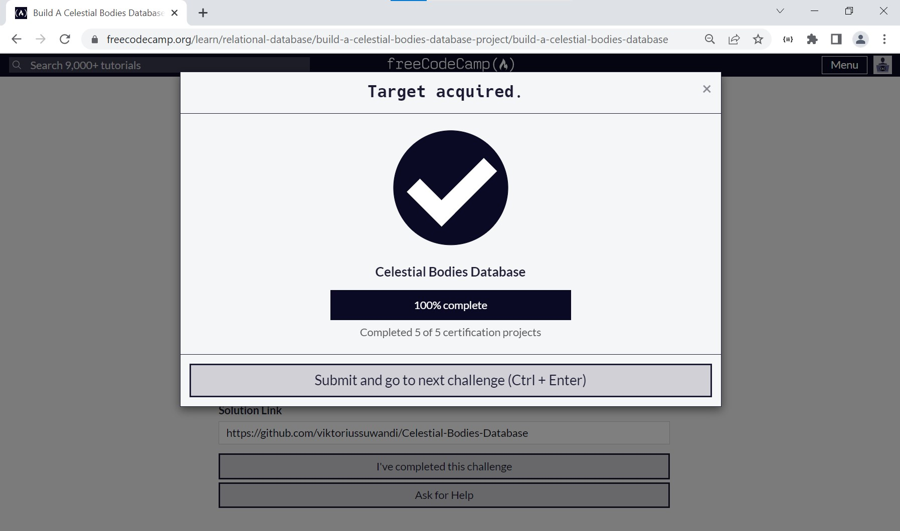

# Celestial Bodies Database
#### Open [`file solution.txt`](solution.txt) To follow my terminal command. Solutions divided into several steps :
    1. Create database and connect to it.
    2. Create tables as required conditions.
    3. Fill the tables as required data conditions.
    4. Primary Key and Foreign Key assignment.
    5. Compact queries into universe.sql file.

#### Solution can be found on : [https://replit.com/@ViktoriusSuwand/Celestial-Bodies-Database](https://replit.com/@ViktoriusSuwand/Celestial-Bodies-Database)

#### Documentation can be found on :[https://github.com/viktoriussuwandi/Celestial-Bodies-Database](https://github.com/viktoriussuwandi/Celestial-Bodies-Database) 

This is the result to complete the Celestial Bodies Database project. 
Instructions for building this project can be found at 
https://www.freecodecamp.org/learn/relational-database/build-a-celestial-bodies-database-project/build-a-celestial-bodies-database

## Instructions
For this project, you need to log in to PostgreSQL with psql to create your database. Do that by entering `psql --username=freecodecamp --dbname=postgres` in the terminal. Make all the tests below pass to complete the project. Be sure to get creative, and have fun!

**Don't forget to connect to your database after you create it** 😄

Here's some ideas for other column and table names: `description`, `has_life`, `is_spherical`, `age_in_millions_of_years`, `planet_types`, `galaxy_types`, `distance_from_earth`.

Notes:
If you leave your virtual machine, your database may not be saved. You can make a dump of it by entering `pg_dump -cC --inserts -U freecodecamp universe > universe.sql` in a bash terminal (not the psql one). It will save the commands to rebuild your database in `universe.sql`. The file will be located where the command was entered. If it's anything inside the `project` folder, the file will be saved in the VM. You can rebuild the database by entering `psql -U postgres < universe.sql` in a terminal where the `.sql` file is.

If you are saving your progress on [freeCodeCamp.org](https://www.freecodecamp.org/), after getting all the tests to pass, follow the instructions above to save a dump of your database. Save the `universe.sql` file in a public repository and submit the URL to it on [freeCodeCamp.org](https://www.freecodecamp.org/).

## CodeRoad
1. You should create a database named `universe`.
2. Be sure to connect to your database with `\c universe`. Then, you should add tables named `galaxy`, `star`, `planet`, and `moon`.
3. Each table should have a `primary key`.
4. Each `primary key` should automatically increment.
5. Each table should have a `name` column.
6. You should use the `INT` data type for at least two columns that are not a primary or foreign key.
7. You should use the `NUMERIC` data type at least once.
8. You should use the `TEXT` data type at least once.
9. You should use the `BOOLEAN` data type on at least two columns.
10. Each `star` should have a `foreign key` that references one of the rows in `galaxy`.
11. Each `planet` should have a `foreign key` that references one of the rows in `star`.
12. Each `moon` should have a `foreign key` that references one of the rows in `planet`.
13. Your database should have at least five `tables`.
14. Each table should have at least three rows.
15. The `galaxy` and `star` tables should each have at least six rows.
16. The `planet` table should have at least 12 rows.
17. The `moon` table should have at least 20 rows.
18. Each table should have at least three columns.
19. The `galaxy`, `star`, `planet`, and `moon` tables should each have at least five columns.
20. At least two columns per table should not accept `NULL` values.
21. At least one column from each table should be required to be `UNIQUE`.
22. All columns named name should be of type `VARCHAR`.
23. Each `primary key` column should follow the naming convention `table_name_id`. For example : the `moon` table should have a `primary key` column named `moon_id`.
24. Each `foreign key` column should have the same name as the `column` it is referencing.

## Result
### Testing

### Submission
